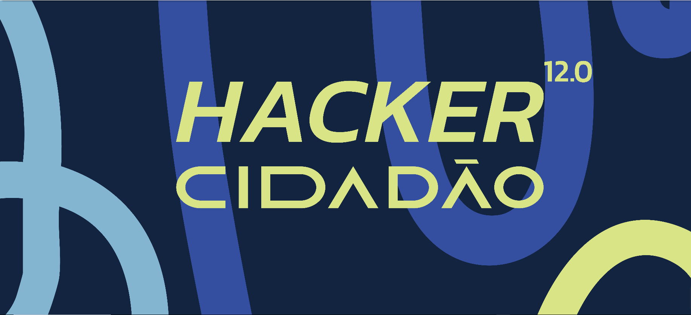

# 🚀 Hackathon - Hacker Cidadão 12.0 

# Desafio

O  [Hub de Dados Aberto da Prefeitura do Recife](https://hubdedados.recife.pe.gov.br/)  é uma iniciativa que transforma dados públicos em ferramentas de empoderamento do cidadão, promovendo transparência e políticas públicas baseadas em evidências. Para expandir o acesso, é essencial melhorar a participação popular e o entendimento desses dados pela população, além de engajar os cidadãos para contribuir com soluções para problemas urbanos.

O **Hacker Cidadão 12.0** busca soluções inovadoras para melhorar a experiência do usuário, tornando os dados mais acessíveis e interativos. As tecnologias sugeridas incluem inteligência artificial, painéis dinâmicos, storytelling e chatbots, entre outras.

### Metas
- Desenvolver soluções que facilitem o acesso e entendimento dos dados.
- Criar ferramentas interativas, como dashboards e visualizações dinâmicas.
- Integrar inteligência artificial para auxiliar na interpretação e uso dos dados.
- Promover o engajamento do cidadão com experiências intuitivas.
- Enriquecer o Portal do Hub de Dados com funcionalidades mais acessíveis e úteis.
- Permitir o cruzamento de dados de forma amigável para o usuário comum.

### Indicadores de Sucesso
- Aumento de acessos e interações no Portal do Hub de Dados.
- Melhora na satisfação do usuário (pesquisas ou feedbacks).
- Crescimento no número de visualizações e downloads de dados.
- Implementação de soluções com IA ou ferramentas interativas.
- Engajamento da comunidade em eventos e desafios de dados abertos.

# 🤖 DigAI - Chatbot 

Para atender às necessidades do desafio, propomos o desenvolvimento de um Chatbot que permite aos cidadãos acessarem o [Hub de Dados Aberto da Prefeitura do Recife](https://hubdedados.recife.pe.gov.br/) de forma intuitiva e acessível.

### Funcionalidades principais:
- **Navegação por áreas de interesse**: O usuário poderá selecionar diferentes áreas de interesse (como saúde, educação, segurança, etc.) diretamente no aplicativo, iniciando uma conversa com o chatbot.
- **Interação em linguagem natural**: O chatbot será alimentado com a IA do **Gemini**, que permitirá que os cidadãos façam perguntas em linguagem natural. Ele será capaz de entender e interpretar essas perguntas e fornecer respostas precisas com base nos dados abertos.
- **Respostas baseadas em dados**: Ao fazer uma pergunta, o chatbot consultará o banco de dados aberto da Prefeitura do Recife e retornará uma resposta informada e contextualizada, ajudando o usuário a compreender os dados de forma clara e objetiva.
- **Facilidade de atualização e expansão**: O sistema será projetado de forma modular, permitindo fácil atualização e expansão das áreas de dados à medida que novas informações se tornem disponíveis.
- **Sistema Escalonável**: O DigAI é projetado para ser um produto flexível e expansível, permitindo a adição de diversas funcionalidades conforme a necessidade. Por exemplo:
  - **Integração com Google Maps**: O chatbot pode incorporar mapas interativos, permitindo que os usuários compartilhem ou recebam localizações diretamente no chat, facilitando a visualização de dados geográficos.
  - **Incorporação de Áudio**: A funcionalidade de envio e recepção de mensagens de áudio pode ser implementada para tornar a interação mais acessível e melhorar a experiência do usuário, especialmente para pessoas com deficiência ou para quem prefere comunicação verbal.
  - **Exportação de Dados**: O chatbot pode permitir que os usuários baixem conjuntos de dados relevantes em formatos populares como CSV ou Excel, oferecendo maior praticidade e a possibilidade de análises externas.
  - **Adição de Novas Áreas de Dados**: O sistema pode ser facilmente ampliado para integrar novas fontes de dados ou áreas de interesse, garantindo que a plataforma continue relevante à medida que as necessidades da comunidade evoluem.
